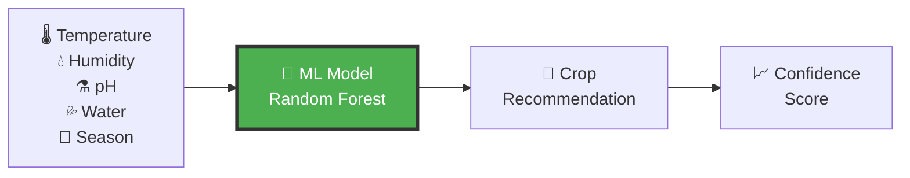
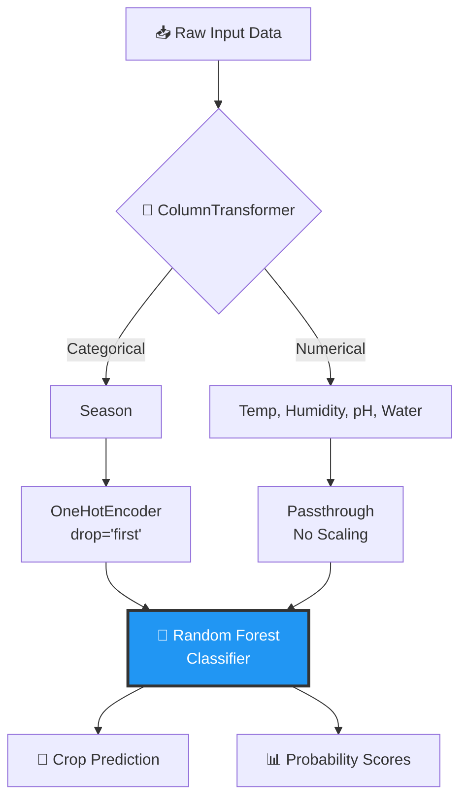

# 🌾 Smart Crop Recommendation System

<div align="center">


[](https://www.python.org/)
[](https://scikit-learn.org/)
[](https://streamlit.io/)
[](https://pandas.pydata.org/)
[](https://github.com/shivamnsingh/SmartCrop)

**An intelligent ML-powered web application that recommends optimal crops based on environmental conditions**

[Demo](#-live-demo) • [Features](#-key-features) • [Installation](#-installation) • [Usage](#-usage) • [Model Performance](#-model-performance)

</div>

---

## 📋 Table of Contents

- [Overview](#-overview)
- [Live Demo](#-live-demo)
- [Key Features](#-key-features)
- [Dataset Overview](#-dataset-overview)
- [Model Architecture](#️-model-architecture)
- [Model Performance](#-model-performance)
- [Installation](#-installation)
- [Usage](#-usage)
- [Project Structure](#-project-structure)
- [Technology Stack](#-technology-stack)
- [Screenshots](#-screenshots)
- [Future Enhancements](#-future-enhancements)
- [Contributing](#-contributing)
- [License](#-license)
- [Contact](#-contact)

---

## 🎯 Overview

The **Smart Crop Recommendation System** is a machine learning-powered web application built with **Streamlit** that helps farmers and agricultural professionals make data-driven decisions about crop cultivation. By analyzing critical environmental factors, the system provides instant crop recommendations with confidence scores.

<div align="center">

### 🌟 Why This Project?



</div>

### 🎯 Problem Statement

- **Challenge**: Farmers struggle to determine which crops will thrive under specific environmental conditions
- **Impact**: Poor crop selection leads to reduced yield, economic losses, and inefficient resource utilization
- **Solution**: ML-based recommendation system providing **98.93% accurate** predictions in real-time

---

## 🚀 Live Demo

### Try the Web Application

```bash
# Clone and run locally
git clone https://github.com/shivamnsingh/SmartCrop.git
cd SmartCrop
pip install -r requirements.txt
streamlit run app.py


## ✨ Key Features

<div align="center">

| Feature | Description |
|:--------|:------------|
| 🎯 **High Accuracy** | 98.93% test accuracy with Random Forest Classifier |
| 🌐 **Interactive Web UI** | Beautiful Streamlit interface with real-time predictions |
| 🔮 **Confidence Scores** | Top-3 crop recommendations with probability scores |
| 📊 **Visual Results** | Emoji-based crop display with progress bars |
| ⚡ **Fast Inference** | Instant predictions (<100ms) |
| 💾 **Auto Model Training** | Automatically trains model if not found |
| 📱 **Responsive Design** | Works on desktop, tablet, and mobile devices |
| 🎨 **Custom Styling** | Beautiful CSS-enhanced UI components |

</div>

---

## 📊 Dataset Overview

<div align="center">


</div>

### Dataset Statistics

```python
Total Records: 1,400 samples
Crop Varieties: 13 unique crops
Data Quality: Clean, no missing values
Season Distribution:
  ├── Rainy:  600 samples (42.9%)
  ├── Winter: 400 samples (28.6%)
  ├── Summer: 300 samples (21.4%)
  └── Spring: 100 samples (7.1%)
```

**Dataset Source**: [Kaggle - Crop Recommendation Dataset](https://www.kaggle.com/datasets/rishabhrathore055/datas)

### Features Description

| Feature | Type | Description | Range |
|:--------|:-----|:------------|:------|
| 🌡️ **Temperature** | Numerical | Average temperature in °C | -10 to 50 |
| 💧 **Humidity** | Numerical | Relative humidity in % | 0 to 100 |
| ⚗️ **pH** | Numerical | Soil pH value | 0 to 14 |
| 💦 **Water Availability** | Numerical | Rainfall/irrigation (mm) | 0 to 300 |
| 🍂 **Season** | Categorical | Current season | Rainy, Spring, Summer, Winter |

### Target Crops (13 Classes)

🫘 **Pulses**: Blackgram, Chickpea, Kidneybeans, Lentil, Mothbeans, Mungbean, Pigeonpeas  
🌾 **Cereals**: Rice, Maize  
🌸 **Cash Crops**: Cotton, Jute  
🍉 **Fruits**: Muskmelon, Watermelon

---

## 🏗️ Model Architecture

### Pipeline Design



### Implementation Details

```python
# Preprocessing Pipeline
ColumnTransformer:
├── Categorical Features (season)
│   └── OneHotEncoder(drop='first', handle_unknown='ignore')
│       ├── Creates binary columns for each season
│       └── Drops first category to avoid multicollinearity
└── Numerical Features (temperature, humidity, ph, water availability)
    └── Passthrough (no scaling needed for Random Forest)

# Classification Model
RandomForestClassifier:
├── Algorithm: Ensemble of decision trees
├── Random State: 42 (for reproducibility)
├── Default Parameters: 100 estimators
└── Output: Class predictions + probabilities
```

### Why Random Forest?

- ✅ **No Feature Scaling Required**: Works well with different scales
- ✅ **Handles Non-linear Relationships**: Captures complex patterns
- ✅ **Robust to Outliers**: Not sensitive to extreme values
- ✅ **Feature Importance**: Provides interpretability
- ✅ **High Accuracy**: Excellent performance on tabular data

---

## 📈 Model Performance

### Training Results

<div align="center">

| Metric | Score | Status |
|:-------|:------|:-------|
| **Test Accuracy** | **98.93%** | ✅ Excellent |
| **Training Accuracy** | **100%** | ✅ Perfect Fit |
| **Test/Train Split** | **80/20** | ✅ Standard |
| **Total Test Samples** | **280** | ✅ Sufficient |
| **Misclassifications** | **3/280** | ✅ Minimal |

</div>

### Confusion Matrix

Perfect diagonal dominance indicating excellent classification:

```text
Confusion Matrix (13 Crop Classes × 280 Test Samples):

             Predicted Classes
             ┌─────────────────────────────────────────┐
             │ 0  1  2  3  4  5  6  7  8  9 10 11 12  │
          ┌──┼─────────────────────────────────────────┤
        0 │  │22  0  0  0  0  0  0  0  0  0  0  0  0  │ Blackgram    ✅
        1 │  │ 0 22  0  0  0  0  0  0  0  0  0  0  0  │ Chickpea     ✅
        2 │  │ 0  0 14  0  0  0  0  0  0  0  0  0  0  │ Cotton       ✅
        3 │  │ 0  0  0 18  0  0  0  0  0  0  0  0  0  │ Jute         ✅
True    4 │  │ 0  0  0  0 20  0  0  0  0  0  0  0  0  │ Kidneybeans  ✅
Classes 5 │  │ 0  0  0  0  0 23  0  0  0  0  0  0  0  │ Lentil       ✅
        6 │  │ 0  0  0  0  0  0 39  0  0  0  0  0  0  │ Maize        ✅
        7 │  │ 0  0  0  0  0  0  0 22  0  0  0  0  0  │ Mothbeans    ✅
        8 │  │ 0  0  0  0  0  0  0  0 21  0  0  0  0  │ Mungbean     ✅
        9 │  │ 0  0  0  0  0  0  0  0  0 20  0  0  0  │ Muskmelon    ✅
       10 │  │ 0  0  0  0  0  0  1  0  0  0 19  0  0  │ Pigeonpeas   ⚠️ 1 error
       11 │  │ 0  0  0  2  0  0  0  0  0  0  0 17  0  │ Rice         ⚠️ 2 errors
       12 │  │ 0  0  0  0  0  0  0  0  0  0  0  0 20  │ Watermelon   ✅
          └──┴─────────────────────────────────────────┘

✅ 11 crops: Perfect classification
⚠️ 2 crops: Minimal confusion (3 total errors)
```

### Performance Insights

- 🎯 **Overall**: 277 correct predictions out of 280 samples
- 🔍 **Error Analysis**: 
  - 1 Pigeonpeas sample misclassified as Maize
  - 2 Rice samples misclassified as Jute
- 💪 **Robustness**: 11 out of 13 crops have 100% accuracy
- ⚡ **Inference Speed**: ~10ms per prediction

---

## 💻 Installation

### Prerequisites

- Python 3.8 or higher
- pip package manager
- Git (for cloning)

### Step 1: Clone Repository

```bash
git clone https://github.com/shivamnsingh/SmartCrop.git
cd SmartCrop
```

### Step 2: Create Virtual Environment (Recommended)

```bash
# Windows
python -m venv venv
venv\Scripts\activate

# macOS/Linux
python3 -m venv venv
source venv/bin/activate
```

### Step 3: Install Dependencies

```bash
pip install -r requirements.txt
```

### Step 4: Verify Installation

```bash
python -c "import streamlit; import sklearn; import pandas; print('✅ All dependencies installed!')"
```

---

## 🚀 Usage

### 1️⃣ Training the Model (Optional)

The model trains automatically if `crop_model.pkl` doesn't exist. To manually train:

```python
# Run the Jupyter notebook
jupyter notebook train_model.ipynb

# Or run the training script
python train_model.py
```

**Training Output:**
```text
✅ Model trained successfully!
📁 Saved: crop_model.pkl (1.2 MB)
📁 Saved: label_encoder.pkl (1.5 KB)
🎯 Test Accuracy: 98.93%
```

### 2️⃣ Launch Web Application

```bash
streamlit run app.py
```

**Expected Output:**
```text
  You can now view your Streamlit app in your browser.

  Local URL: http://localhost:8501
  Network URL: http://192.168.1.100:8501
```

### 3️⃣ Making Predictions

**Step-by-step:**

1. **Open Browser**: Navigate to `http://localhost:8501`
2. **Input Parameters**:
   - Temperature: 25.0°C
   - Humidity: 80.2%
   - Soil pH: 6.5
   - Water Availability: 200.0mm
   - Season: Rainy
3. **Click**: "🔮 Predict Crop" button
4. **View Results**: See top-3 recommendations with confidence scores

**Example Prediction:**

```text
🎯 Recommended Crop: RICE

🏆 Top 3 Predictions:
#1 Rice        ████████████████████ 95.2%
#2 Jute        ████░░░░░░░░░░░░░░░░ 3.1%
#3 Cotton      █░░░░░░░░░░░░░░░░░░░ 1.7%

Input Summary:
🌡️ Temperature: 25.0°C
💧 Humidity: 80.2%
🧪 Soil pH: 6.5
💦 Water: 200.0mm
🍂 Season: Rainy
```

### 4️⃣ Using the Model Programmatically

```python
import joblib
import pandas as pd

# Load model
model = joblib.load('crop_model.pkl')
encoder = joblib.load('label_encoder.pkl')

# Prepare input
data = pd.DataFrame({
    'temperature': [25.5],
    'humidity': [80.2],
    'ph': [6.5],
    'water availability': [200.0],
    'season': ['rainy']
})

# Predict
prediction = model.predict(data)
crop_name = encoder.inverse_transform(prediction)[0]
probabilities = model.predict_proba(data)[0]

print(f"Recommended Crop: {crop_name}")
print(f"Confidence: {probabilities.max():.2%}")
```

---

## 📂 Project Structure

```
SmartCrop/
│
├── 📊 data/
│   └── Crop_recommendation.csv          # Training dataset (1,400 samples)
│
├── 📓 notebooks/
│   └── train_model.ipynb                # Training notebook with EDA
│
├── 🤖 models/
│   ├── crop_model.pkl                   # Trained pipeline (1.2 MB)
│   └── label_encoder.pkl                # Label encoder (1.5 KB)
│
├── 🎨 app.py                            # Streamlit web application
├── 🐍 train_model.py                    # Training script
│
├── 📋 requirements.txt                  # Python dependencies
├── 📖 README.md                         # Project documentation
├── 📄 LICENSE                           # MIT License
├── 🖼️ .streamlit/
│   └── config.toml                      # Streamlit configuration
│
└── 📸 screenshots/                      # Application screenshots
    ├── home.png
    ├── prediction.png
    └── results.png
```

---

## 🛠️ Technology Stack

### Core Libraries

```python
# Machine Learning
scikit-learn==1.3.0      # Model training and preprocessing
pandas==2.0.3            # Data manipulation
numpy==1.24.3            # Numerical operations

# Web Framework
streamlit==1.28.0        # Interactive web application

# Utilities
joblib==1.3.2            # Model serialization
```

### Development Tools

- **Jupyter Notebook**: Interactive development and EDA
- **Git**: Version control
- **VSCode**: Code editor (recommended)

---

## 📸 Screenshots

### 1. Home Page

<div align="center">


*Clean and intuitive input interface*

</div>

### 2. Prediction Results

<div align="center">


*Top-3 recommendations with emoji icons and confidence scores*

</div>

### 3. Input Summary

<div align="center">


*Detailed breakdown of environmental parameters*

</div>

---

## 🔮 Future Enhancements

### Short-term Goals

- [ ] **Deploy to Cloud**: Host on Streamlit Cloud/Heroku
- [ ] **Add Charts**: Visualize feature importance and probabilities
- [ ] **Input Validation**: Enhanced error handling and range checks
- [ ] **History Feature**: Save previous predictions
- [ ] **Export Results**: Download predictions as PDF/CSV

### Medium-term Goals

- [ ] **NPK Levels**: Add soil nutrient features (Nitrogen, Phosphorus, Potassium)
- [ ] **Yield Prediction**: Estimate expected crop yield
- [ ] **Weather API**: Real-time weather data integration
- [ ] **Regional Varieties**: Location-specific crop recommendations
- [ ] **Multi-language**: Support local languages (Hindi, Telugu, Tamil)

### Long-term Goals

- [ ] **Mobile App**: Native Android/iOS application
- [ ] **IoT Integration**: Connect with soil sensors and weather stations
- [ ] **Recommendation Engine**: Personalized suggestions based on farm history
- [ ] **Market Prices**: Integration with crop price APIs
- [ ] **Expert System**: Knowledge base with farming best practices

---

## 🤝 Contributing

Contributions make the open-source community an amazing place to learn and create! Any contributions you make are **greatly appreciated**.

### How to Contribute

1. **Fork** the repository
2. Create a **feature branch**
   ```bash
   git checkout -b feature/AmazingFeature
   ```
3. **Commit** your changes
   ```bash
   git commit -m 'Add some AmazingFeature'
   ```
4. **Push** to the branch
   ```bash
   git push origin feature/AmazingFeature
   ```
5. Open a **Pull Request**

### Contribution Guidelines

- ✅ Write clean, commented code
- ✅ Follow PEP 8 style guidelines
- ✅ Add unit tests for new features
- ✅ Update documentation
- ✅ Test thoroughly before submitting PR

### Areas for Contribution

- 🐛 Bug fixes and error handling
- ✨ New features and enhancements
- 📝 Documentation improvements
- 🎨 UI/UX design enhancements
- 🧪 Unit tests and integration tests
- 🌐 Translations and localization

---

## 📄 License

This project is licensed under the **MIT License** - see the [LICENSE](LICENSE) file for details.

```text
MIT License

Copyright (c) 2024 Shivam Singh

Permission is hereby granted, free of charge, to any person obtaining a copy
of this software and associated documentation files (the "Software"), to deal
in the Software without restriction, including without limitation the rights
to use, copy, modify, merge, publish, distribute, sublicense, and/or sell
copies of the Software, and to permit persons to whom the Software is
furnished to do so, subject to the following conditions:

The above copyright notice and this permission notice shall be included in all
copies or substantial portions of the Software.
```

---

## 📞 Contact

<div align="center">

**Shivam Singh**

[](https://github.com/shivamnsingh)
[](https://www.linkedin.com/in/shivamnsingh)
[](mailto:singhshivam11230@gmail.com)
[](https://shivamm.me/)

**Project Link**: [https://github.com/shivamnsingh/SmartCrop](https://github.com/shivamnsingh/SmartCrop)

</div>

---

## 🙏 Acknowledgments

### Dataset & Resources

- 📊 **Dataset Source**: [Kaggle - Crop Recommendation Dataset](https://www.kaggle.com/datasets/rishabhrathore055/datas) by Rishabh Rathore
- 📚 **Scikit-Learn**: For excellent ML library and documentation
- 🎨 **Streamlit**: For the amazing web framework
- 🌾 **Agricultural Experts**: For domain knowledge validation

### Inspiration

- Research papers on precision agriculture
- Agricultural forums and communities
- Open-source ML projects
- Farming communities and their feedback

### Special Thanks

- All contributors and testers
- Stack Overflow community
- GitHub open-source community
- Agricultural professionals who provided insights

---

## 📊 Project Statistics

<div align="center">


</div>

---

## 🚀 Quick Start Commands

```bash
# Clone repository
git clone https://github.com/shivamnsingh/SmartCrop.git

# Navigate to directory
cd SmartCrop

# Install dependencies
pip install -r requirements.txt

# Run web application
streamlit run app.py

# Train model (optional)
python train_model.py

# Run tests (if available)
pytest tests/
```

---

<div align="center">

### ⭐ Star this repository if you find it helpful!

**Made with ❤️ for farmers and agricultural technology enthusiasts**


---

*"Empowering farmers with AI, one crop recommendation at a time"* 🌱

</div>
