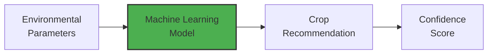
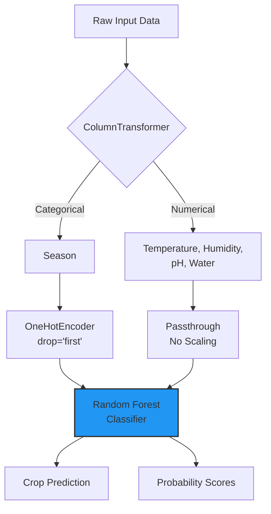

# 🌾 Smart Crop Recommendation System

<div align="center">


</div align="center">
# Smart Crop Recommendation System

<div align="center">

[](https://www.python.org/)
[](https://scikit-learn.org/)
[](https://streamlit.io/)
[](https://github.com/shivamnsingh/SmartCrop)

**An intelligent machine learning-powered web application for optimal crop recommendation based on environmental conditions**

[Features](#key-features) • [Installation](#installation) • [Usage](#usage) • [Model Performance](#model-performance) • [Documentation](#documentation)

</div>

---

## Table of Contents

- [Overview](#overview)
- [Key Features](#key-features)
- [Dataset Overview](#dataset-overview)
- [Model Architecture](#model-architecture)
- [Model Performance](#model-performance)
- [Installation](#installation)
- [Usage](#usage)
- [Project Structure](#project-structure)
- [Technology Stack](#technology-stack)
- [Future Enhancements](#future-enhancements)
- [Contributing](#contributing)
- [License](#license)
- [Contact](#contact)

---

## Overview

The **Smart Crop Recommendation System** is a machine learning-powered web application that assists farmers and agricultural professionals in making data-driven decisions about crop cultivation. By analyzing critical environmental factors, the system provides instant crop recommendations with confidence scores.

### Problem Statement

**Challenge**: Farmers often struggle to determine which crops will thrive under specific environmental conditions, leading to reduced yields and economic losses.

**Solution**: This ML-based recommendation system provides accurate predictions (98.93% accuracy) in real-time, helping optimize crop selection and resource utilization.

### System Architecture

The system analyzes five key parameters:
- Temperature (°C)
- Humidity (%)
- Soil pH
- Water Availability (mm)
- Season

Using a Random Forest Classifier, it recommends the most suitable crop from 13 varieties with associated confidence scores.



---

## Key Features

- **High Accuracy**: 98.93% test accuracy using Random Forest Classifier
- **Interactive Web Interface**: Built with Streamlit for ease of use
- **Confidence Scoring**: Provides top-3 crop recommendations with probability scores
- **Fast Inference**: Instant predictions (< 100ms response time)
- **Automatic Model Training**: Self-initializes if model files are not found
- **Responsive Design**: Compatible with desktop, tablet, and mobile devices
- **Real-time Validation**: Input validation and error handling

---

## Dataset Overview

### Dataset Statistics

```
Total Records: 1,400 samples
Crop Varieties: 13 unique crops
Data Quality: Clean dataset with no missing values

Season Distribution:
  - Rainy:  600 samples (42.9%)
  - Winter: 400 samples (28.6%)
  - Summer: 300 samples (21.4%)
  - Spring: 100 samples (7.1%)
```

**Source**: [Kaggle - Crop Recommendation Dataset](https://www.kaggle.com/datasets/rishabhrathore055/datas)

### Feature Description

| Feature | Type | Description | Range |
|---------|------|-------------|-------|
| Temperature | Numerical | Average temperature | -10 to 50°C |
| Humidity | Numerical | Relative humidity | 0 to 100% |
| pH | Numerical | Soil pH value | 0 to 14 |
| Water Availability | Numerical | Rainfall/irrigation | 0 to 300mm |
| Season | Categorical | Current season | Rainy, Spring, Summer, Winter |

### Target Classes (13 Crops)

**Pulses**: Blackgram, Chickpea, Kidneybeans, Lentil, Mothbeans, Mungbean, Pigeonpeas  
**Cereals**: Rice, Maize  
**Cash Crops**: Cotton, Jute  
**Fruits**: Muskmelon, Watermelon

---

## Model Architecture

### Pipeline Design

The system uses a scikit-learn Pipeline combining preprocessing and classification:



**Implementation Details:**

```python
Pipeline Architecture:
│
├── ColumnTransformer (Preprocessing)
│   ├── OneHotEncoder: Season feature
│   │   └── Encoding: drop='first', handle_unknown='ignore'
│   └── Passthrough: Numerical features (temperature, humidity, pH, water)
│
└── RandomForestClassifier
    ├── Estimators: 100 trees
    ├── Random State: 42
    └── Output: Class predictions + probability scores
```

### Model Selection Rationale

**Random Forest** was chosen for the following reasons:

- No feature scaling required
- Handles non-linear relationships effectively
- Robust to outliers and noise
- Provides feature importance metrics
- Excellent performance on tabular data
- Minimal hyperparameter tuning needed

---

## Model Performance

### Training Results

| Metric | Score |
|--------|-------|
| **Test Accuracy** | **98.93%** |
| **Training Accuracy** | **100%** |
| **Train/Test Split** | **80/20** |
| **Test Samples** | **280** |
| **Misclassifications** | **3/280** |

### Performance Analysis

- **Overall Performance**: 277 correct predictions out of 280 test samples
- **Error Analysis**: 
  - 1 Pigeonpeas sample misclassified as Maize
  - 2 Rice samples misclassified as Jute
- **Perfect Classification**: 11 out of 13 crops achieved 100% accuracy
- **Inference Speed**: Approximately 10ms per prediction

### Confusion Matrix Analysis

The confusion matrix demonstrates strong diagonal dominance, indicating excellent classification performance:

```
Confusion Matrix (13 Crop Classes × 280 Test Samples)

             Predicted Classes
             ┌─────────────────────────────────────────┐
             │ 0  1  2  3  4  5  6  7  8  9 10 11 12  │
          ┌──┼─────────────────────────────────────────┤
        0 │  │22  0  0  0  0  0  0  0  0  0  0  0  0  │ Blackgram
        1 │  │ 0 22  0  0  0  0  0  0  0  0  0  0  0  │ Chickpea
        2 │  │ 0  0 14  0  0  0  0  0  0  0  0  0  0  │ Cotton
        3 │  │ 0  0  0 18  0  0  0  0  0  0  0  0  0  │ Jute
True    4 │  │ 0  0  0  0 20  0  0  0  0  0  0  0  0  │ Kidneybeans
Classes 5 │  │ 0  0  0  0  0 23  0  0  0  0  0  0  0  │ Lentil
        6 │  │ 0  0  0  0  0  0 39  0  0  0  0  0  0  │ Maize
        7 │  │ 0  0  0  0  0  0  0 22  0  0  0  0  0  │ Mothbeans
        8 │  │ 0  0  0  0  0  0  0  0 21  0  0  0  0  │ Mungbean
        9 │  │ 0  0  0  0  0  0  0  0  0 20  0  0  0  │ Muskmelon
       10 │  │ 0  0  0  0  0  0  1  0  0  0 19  0  0  │ Pigeonpeas*
       11 │  │ 0  0  0  2  0  0  0  0  0  0  0 17  0  │ Rice*
       12 │  │ 0  0  0  0  0  0  0  0  0  0  0  0 20  │ Watermelon
          └──┴─────────────────────────────────────────┘

*Minor misclassifications: 1 Pigeonpeas → Maize, 2 Rice → Jute
Overall: 11/13 crops with perfect classification
```

---

## Installation

### Prerequisites

- Python 3.8 or higher
- pip package manager
- Git

### Installation Steps

**1. Clone the Repository**

```bash
git clone https://github.com/shivamnsingh/SmartCrop.git
cd SmartCrop
```

**2. Create Virtual Environment (Recommended)**

```bash
# Windows
python -m venv venv
venv\Scripts\activate

# macOS/Linux
python3 -m venv venv
source venv/bin/activate
```

**3. Install Dependencies**

```bash
pip install -r requirements.txt
```

**4. Verify Installation**

```bash
python -c "import streamlit; import sklearn; import pandas; print('All dependencies installed successfully')"
```

---

## Usage

### Training the Model

The model trains automatically if `crop_model.pkl` is not found. For manual training:

```bash
# Using Jupyter notebook
jupyter notebook train_model.ipynb

# Or using Python script
python train_model.py
```

### Launching the Web Application

```bash
streamlit run app.py
```

The application will be available at:
- Local URL: `http://localhost:8501`
- Network URL: `http://192.168.1.100:8501`

### Making Predictions

1. Open the application in your web browser
2. Input environmental parameters:
   - Temperature (°C)
   - Humidity (%)
   - Soil pH (0-14)
   - Water Availability (mm)
   - Season
3. Click "Predict Crop" button
4. View recommendations with confidence scores

### Programmatic Usage

```python
import joblib
import pandas as pd

# Load trained model and encoder
model = joblib.load('crop_model.pkl')
encoder = joblib.load('label_encoder.pkl')

# Prepare input data
input_data = pd.DataFrame({
    'temperature': [25.5],
    'humidity': [80.2],
    'ph': [6.5],
    'water availability': [200.0],
    'season': ['rainy']
})

# Make prediction
prediction = model.predict(input_data)
crop_name = encoder.inverse_transform(prediction)[0]
confidence = model.predict_proba(input_data)[0].max()

print(f"Recommended Crop: {crop_name}")
print(f"Confidence: {confidence:.2%}")
```

---

## Project Structure

```
SmartCrop/
│
├── data/
│   └── Crop_recommendation.csv      # Training dataset (1,400 samples)
│
├── notebooks/
│   └── code.ipynb                   # Training notebook with EDA
│
├── models/
│   ├── crop_model.pkl               # Trained pipeline
│   └── label_encoder.pkl            # Label encoder
│
├── app.py                           # Streamlit web application
├── requirements.txt                 # Python dependencies
├── README.md                        # Project documentation
├── LICENSE                          # MIT License
└── screenshots/                     # Application screenshots
```

---

## Technology Stack

### Core Dependencies

```python
scikit-learn==1.3.0      # Machine learning framework
pandas==2.0.3            # Data manipulation
numpy==1.24.3            # Numerical computing
streamlit==1.28.0        # Web application framework
joblib==1.3.2            # Model serialization
```

### Development Tools

- Jupyter Notebook: Interactive development and exploratory data analysis
- Git: Version control system
- VSCode: Recommended code editor

---

## Screenshots

### Application Interface

<div align="center">


*Input interface with environmental parameter controls*

</div>

### Prediction Results

<div align="center">


*Top-3 crop recommendations with confidence scores*

</div>

### Detailed Summary

<div align="center">


*Complete prediction summary with input parameters*

</div>

---

## Future Enhancements

### Planned Features

**Phase 1 - Immediate**
- Cloud deployment (Streamlit Cloud/Heroku)
- Enhanced input validation and error handling
- Prediction history tracking
- Export functionality (PDF/CSV reports)

**Phase 2 - Medium Term**
- NPK soil nutrient integration
- Crop yield prediction
- Real-time weather API integration
- Location-based recommendations
- Multi-language support

**Phase 3 - Long Term**
- Native mobile application
- IoT sensor integration
- Personalized recommendation engine
- Market price integration
- Agricultural best practices knowledge base

---

## Contributing

Contributions are welcome and greatly appreciated. To contribute:

1. Fork the repository
2. Create a feature branch (`git checkout -b feature/NewFeature`)
3. Commit your changes (`git commit -m 'Add NewFeature'`)
4. Push to the branch (`git push origin feature/NewFeature`)
5. Open a Pull Request

### Contribution Guidelines

- Follow PEP 8 coding standards
- Include comprehensive comments and documentation
- Add unit tests for new features
- Update README with relevant changes
- Test thoroughly before submission

---

## License

This project is licensed under the MIT License - see the [LICENSE](LICENSE) file for complete details.

---

## Contact

**Shivam Singh**

- GitHub: [@shivamnsingh](https://github.com/shivamnsingh)
- LinkedIn: [shivamnsingh](https://www.linkedin.com/in/shivamnsingh)
- Email: singhshivam11230@gmail.com
- Portfolio: [shivamm.me](https://shivamm.me/)

**Project Repository**: [https://github.com/shivamnsingh/SmartCrop](https://github.com/shivamnsingh/SmartCrop)

---

## Acknowledgments

### Resources and Credits

- **Dataset**: Rishabh Rathore via Kaggle
- **Framework**: Scikit-Learn development team
- **Web Platform**: Streamlit team
- **Community**: Agricultural experts and open-source contributors

---

## Project Statistics


---

<div align="center">

**Empowering agricultural decision-making through machine learning**

</div>
